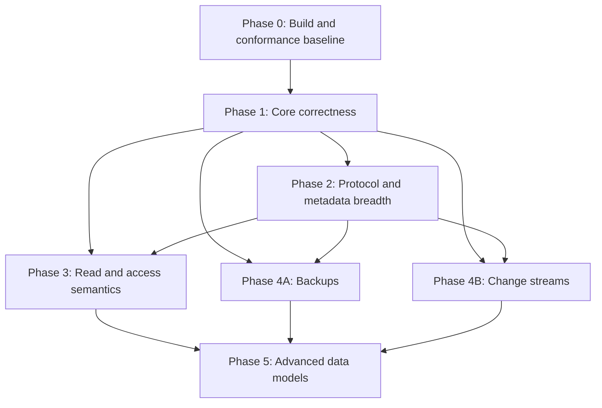

# Bigtable Emulator Conformance Implementation Plan

**Status:** In progress — Phase 0 complete and verified; Phase 1 not started

**Date:** 2026-08-29

**Architecture:** [`../specs/2026-08-29-bigtable-conformance-architecture-design.md`](../specs/2026-08-29-bigtable-conformance-architecture-design.md)
**Audit baseline:** [`../../../BIGTABLE_COMPATIBILITY.md`](../../../BIGTABLE_COMPATIBILITY.md)

## Outcome

Deliver a correctness-first Bigtable emulator that supports ordinary local Data/Table workflows and broad, honest protocol compatibility. A request is compatible only when its behavior is implemented and tested or when it returns an intentional documented error. Silent field ignores and metadata-only success for data-bearing features are not acceptable.

## Complexity labels

- **Easy (E):** localized validation, metadata persistence, CRUD, pure filter/GC behavior, or explicit rejection. It does not require a new transaction, query, snapshot, or streaming engine.
- **Complex (C):** cross-RPC behavior, a persistence migration with semantic cutover, transactional eventing, streaming/resume state, access enforcement, snapshots, typed aggregation, or query execution.
- **Deferred (D):** managed-service behavior with no useful deterministic single-process contract.

These labels describe architectural coupling, not priority or duration. P0 correctness contains both Easy and Complex work.

## Support levels

Every RPC and meaningful request field must have one checked-in disposition:

1. **Supported:** observable local behavior matches the contract exercised by conformance tests.
2. **Locally simplified:** behavior is deterministic and documented, and omits only managed infrastructure.
3. **Explicitly unsupported:** the service is registered and returns `Unimplemented` or `FailedPrecondition` before mutation.
4. **Not applicable:** managed-only behavior is not simulated; any exposed metadata does not imply behavior.

A capability must not move to Supported or Locally simplified until its client-level acceptance test passes.

### Phase 0 disposition clarification

The initial audit exposed capabilities whose target disposition is
`Explicitly unsupported` even though the current handler still returns partial
or metadata-only success. Phase 0 therefore records two independent facts in
the executable ledger: the intended local support disposition and observed
verification (`test_verified`, `known_nonconformant`, or
`declared_unverified`). A disposition is achieved only when it is
`test_verified`; `known_nonconformant` entries remain public gaps until the
owning implementation phase changes runtime behavior. This prevents the Phase
0 declaration from falsely presenting Phase 1 work as complete.

The standalone `cbt` CLI also resolves an authentication source before the Go
client applies emulator transport configuration. The hermetic smoke runs from
an empty directory without inherited home/ADC/gcloud configuration and uses
the CLI's documented `-access-token` flag with a non-secret placeholder. It still discovers the
server only through `BIGTABLE_EMULATOR_HOST` and uses no private helper,
credentials file, direct endpoint flag, or SQL access.

## Global implementation rules

1. Keep the public package and generated gRPC services stable.
2. Extract new components inside `bttest`; do not create a parallel server implementation.
3. Move every caller during each extraction and remove the obsolete path in the same change.
4. Return storage errors; no request path may call `log.Fatal` or terminate the process.
5. Validate unsupported targets and fields before opening a transaction or mutating memory.
6. Keep SQLite and PostgreSQL semantics behind one storage contract.
7. Add no permanent dual-read or dual-write migration path.
8. Update `BIGTABLE_COMPATIBILITY.md` only from verified behavior at each phase exit.

## Dependency graph



Phases 4A and 4B can proceed independently after Phases 1 and 2. Phase 5 is a gated advanced-compatibility program, not a prerequisite for the developer-parity release.

---

## Phase 0 — Reproducible build and conformance baseline

### Objective

Make the checked-in repository independently buildable, define the compatibility source of truth, and ensure both promised SQL backends can run the same contract tests.

### 0.1 Repair module metadata — E

**Files:** `go.mod`, `go.sum`, `.github/workflows/test.yaml`

- Use a syntactically valid Go language directive; keep a patch-level toolchain requirement in a `toolchain` directive rather than the `go` directive if required.
- Reconcile indirect dependency versions and checksums with the selected toolchain.
- Remove the need for the temporary external module file used by the audit.
- Align CI, `Build_and_Integration.md`, and the module declaration on one supported Go baseline.

**Acceptance**

- `go mod verify` succeeds against the checked-in files.
- `go test -buildvcs=false ./bttest -count=1` starts without module parsing or checksum errors.

### 0.2 Add an executable capability ledger — E

**Files:** new `bttest/compatibility.go`, new `bttest/compatibility_test.go`, `BIGTABLE_COMPATIBILITY.md`

- Define stable identifiers for RPCs and semantic request fields.
- Record support level, local simplification, and owning test for each identifier.
- Make duplicate or missing capability identifiers fail a test.
- Do not generate behavior from the ledger; it is a tested declaration used by adapters and documentation checks.

**Acceptance**

- The ledger covers every RPC in the generated services currently embedded or registered by `server`.
- A test fails if a newly added RPC has no disposition.

### 0.3 Create shared backend conformance fixtures — C

**Files:** new `bttest/storage_conformance_test.go`, `bttest/sql_schema.go`, `.github/workflows/test.yaml`

- Extract server setup so the same behavioral test can run against SQLite and PostgreSQL.
- Add a PostgreSQL CI service and run storage/service conformance tests against it.
- Keep SQLite as the fast default for pure and client tests.
- Serialize tests that mutate the current package-global dialect until configuration becomes server-scoped.

**Acceptance**

- A row/table persistence test passes unchanged against SQLite and PostgreSQL.
- CI fails independently for either backend.

### 0.4 Add baseline client smoke tests — E

**Files:** new `bttest/client_conformance_test.go`, `.github/workflows/test.yaml`

- Keep the existing official Go-client flow.
- Add a `cbt` smoke covering instance/table/family creation, write, bounded read, and delete; discover the server only through `BIGTABLE_EMULATOR_HOST` and use documented CLI flags.
- Pin or explicitly provision the CLI version in CI so drift is visible.

**Acceptance**

- The smoke path requires no private helper, direct endpoint flag, credentials file, or direct SQL access; any pinned-CLI authentication bootstrap exception is isolated and documented.
- The test records the CLI version on failure.

### Phase 0 exit

- Checked-in module files build without an overlay.
- Capability declarations are exhaustive for the pinned generated interfaces.
- SQLite, PostgreSQL, Go client, and `cbt` have executable baseline coverage.

**Implementation result (2026-08-29): Complete.** Module verification and the
full test/race/vet/format gate pass. The capability ledger is checked against
live gRPC registration, all fields of the eight pinned high-risk messages, and
the existence of behavioral owner tests. The same restart-persistence contract
passes against SQLite and PostgreSQL 17, and the pinned standalone `cbt` smoke
passes in an isolated subprocess environment.

---

## Phase 1 — Core correctness and false-success removal

### Objective

Eliminate data corruption, incompatible filter/GC behavior, and silent acceptance before broadening the API.

### 1.1 Introduce compatibility policy and target resolution — E

**Files:** new `bttest/targets.go`, `bttest/inmem.go`, `bttest/localcloud_change_stream.go`, new `bttest/targets_test.go`

- Resolve table, authorized-view, and materialized-view oneofs into one internal target type.
- Validate app-profile IDs and request-stat modes at the boundary.
- Reject unimplemented view targets, routing modes, stats modes, and query targets before table lookup or mutation.
- Centralize domain-error to gRPC-code translation.
- Preserve the existing table path for valid legacy requests.

**Acceptance**

- Every Data RPC rejects an unsupported target consistently.
- A request combining a valid table with an unsupported app-profile or stats mode leaves state unchanged.

### 1.2 Replace B-tree-shaped row persistence with an error-returning store — C

**Files:** `bttest/sql_rows.go`, `bttest/inmem.go`, `bttest/sql_schema.go`, new `bttest/storage.go`, new `bttest/storage_conformance_test.go`

- Replace `Get`, `ReplaceOrInsert`, `Delete`, `DeleteAll`, and iterator methods that cannot return errors with context-aware load, scan, put, delete, and clear operations.
- Accept a narrow SQL executor implemented by both `*sql.DB` and `*sql.Tx`.
- Add a storage unit-of-work helper that owns begin/commit/rollback.
- Keep the per-table mutex for deterministic single-process serialization; PostgreSQL support does not imply multi-emulator coordination.
- Migrate all callers, including current CMV shadow-table hooks, then remove the obsolete B-tree-shaped methods.

**Acceptance**

- Injected SQL errors return `Internal` from the RPC without exiting the process.
- Scan callback errors stop iteration and propagate.
- SQLite and PostgreSQL pass identical row-store contracts.

### 1.3 Add one atomic row mutation engine — C

**Files:** new `bttest/mutation_engine.go`, `bttest/inmem.go`, `bttest/localcloud_change_stream.go`, `bttest/cmv.go`, new `bttest/mutation_atomicity_test.go`

- Model a mutation request as load → clone → validate all operations → apply in order → GC → persist once → optionally append enabled-feature events → commit.
- Route `MutateRow`, each `MutateRows` entry, `CheckAndMutateRow`, and `ReadModifyWriteRow` through the same engine.
- Preserve each `MutateRows` entry's actual gRPC status; do not remap validation failures to `Internal`.
- Generate change records from committed normalized operations, not from partially applied handlers.
- Disable current direct CMV propagation until the materialized-view engine is reintroduced on committed events.

**Acceptance**

Add failure-after-success tests for all four RPC families. For every test:

- the original row bytes are unchanged;
- no change record exists;
- no derived row changes;
- returned status matches the invalid operation.

Also verify that successful multi-operation requests commit once and return committed values.

### 1.4 Correct filter and GC truth tables — E

**Files:** `bttest/inmem.go`, `bttest/inmem_test.go`, new `bttest/filter_conformance_test.go`

- Preserve duplicate cells produced by `Interleave`; delete the incompatible deduplication expectation.
- Make `Sink` explicitly `Unimplemented` until a proven implementation exists.
- Implement `ValueBitmask` with argument-length and binary edge-case validation.
- Fix GC intersection so a cell is deleted only when every child would delete it.
- Add nested union/intersection truth tables and ensure filters never mutate stored rows.

**Acceptance**

- Officially documented filter examples and nested GC cases pass as pure contract tests.
- Re-reading the same stored row without a filter yields unchanged cells.

### 1.5 Honor sample ranges and quarantine incomplete data-bearing features — E

**Files:** `bttest/inmem.go`, `bttest/localcloud_backups.go`, `bttest/localcloud_change_stream.go`, `bttest/instance_server.go`, `bttest/localcloud_new_features_test.go`

- Restrict `SampleRowKeys` candidates to `row_range`.
- Until later phases re-enable them, reject backup create/copy/restore, change-stream enable/read, executable logical/materialized view use, and unsupported CMV query semantics rather than returning metadata-only success.
- Metadata list/get/delete may remain available if it does not claim data behavior.
- Mark the capability ledger and public docs consistently.

**Acceptance**

- Sampled keys are always within every open/closed boundary combination.
- No data-bearing feature can return success while omitting promised data behavior.

### Phase 1 exit

- All single-row RPCs are rollback-safe.
- P0 filter, GC, target, stats, routing, and sample-range defects have regression coverage.
- Request paths return storage errors instead of terminating the emulator.
- Existing incomplete backups, change streams, and executable views are either disabled explicitly or fully honest about metadata-only scope.

---

## Phase 2 — Protocol and metadata breadth

### Objective

Support bootstrap/Terraform-style administration broadly without faking managed behavior.

### 2.1 Persist complete local table metadata — C

**Files:** `bttest/inmem.go`, `bttest/sql_tables.go`, `bttest/sql_schema.go`, new migration helpers in `bttest/sql_schema.go`, new `bttest/table_admin_conformance_test.go`

- Store the supported `Table` and column-family protobuf fields plus emulator-only family order explicitly.
- Persist deletion protection, automated-backup policy, row-key schema, change-stream configuration, granularity, and aggregate family value type.
- Implement update-mask validation and immutable-field rejection.
- Reject `initial_splits` explicitly until a local partition model exists; never ignore them.
- Migrate old table metadata once, then remove legacy decoding and any dual-write path.

**Acceptance**

- Create/update/restart/get round-trips every supported field on both backends.
- Unknown or unsupported mask paths fail without modifying metadata.
- Deletion protection blocks table deletion after restart.

### 2.2 Normalize resource CRUD semantics — E

**Files:** `bttest/localcloud_instance_admin.go`, `bttest/localcloud_authorized_views.go`, `bttest/localcloud_logical_views.go`, `bttest/instance_server.go`, `bttest/sql_admin_metadata.go`, related tests

- Apply parent validation, deterministic ordering, page size, opaque page token, etag, update-mask, and deletion-protection rules consistently.
- Complete local metadata round trips for instances, clusters, app profiles, authorized views, and logical view descriptors.
- Reject autoscaling, capacity, storage, routing, isolation, and priority semantics that cannot affect the single endpoint.
- Keep undelete explicit `Unimplemented` until tombstone retention is designed.

**Acceptance**

- Pagination traverses each resource exactly once with stable ordering.
- Stale etags fail without mutation.
- Restart persistence tests cover every supported metadata resource.

### 2.3 Implement schema-bundle metadata CRUD — E

**Files:** new `bttest/localcloud_schema_bundles.go`, `bttest/sql_schema.go`, `bttest/inmem.go`, new `bttest/schema_bundle_test.go`

- Register create/get/list/update/delete handlers from the pinned Table Admin interface.
- Persist descriptors, validate names/sizes/update masks, and enforce table parent scoping.
- Do not claim structured-row or SQL execution support merely because descriptors round-trip.

**Acceptance**

- Full CRUD, pagination, restart persistence, and invalid-mask tests pass on both backends.

### 2.4 Make LROs durable and queryable — E

**Files:** `bttest/operations.go`, `bttest/localcloud_instance_admin.go`, `bttest/localcloud_backups.go`, `bttest/sql_schema.go`, new `bttest/operations_test.go`

- Persist operation name, metadata, response or error, done state, and timestamps before returning an LRO.
- Implement deterministic `GetOperation`, parent-scoped `ListOperations`, and `WaitOperation`.
- Return explicit cancellation/deletion errors unless the operation lifecycle truly supports them.
- Replace ad hoc `doneOperation` construction with registry insertion.

**Acceptance**

- Immediately completed operations survive restart and retain their typed response.
- Get/list/wait return consistent results and pagination.

### 2.5 Register auxiliary protocol surfaces — E

**Files:** `bttest/inmem.go`, `bttest/instance_server.go`, `bttest/operations.go`, new service files only where generated interfaces require them, new `bttest/protocol_surface_test.go`

- Register every current generated public service represented in the capability ledger.
- Return one documented synthetic local location from the Locations service.
- Return the single emulator endpoint from RouteLookup while keeping production routing semantics explicitly not applicable.
- Implement a deterministic local consistency-token contract against the single committed store.
- Persist IAM policy round trips while retaining the explicit no-auth local serving model.
- Keep hot-tablet, memory-layer, deprecated snapshot, and managed-only methods explicitly unsupported.

**Acceptance**

- Reflection or descriptor-based tests enumerate registered services and compare them to the capability ledger.
- Every registered RPC returns a declared status rather than `Unknown` or accidental inheritance behavior.

### Phase 2 exit

- Bootstrap metadata survives restart and paginates consistently.
- LRO get/list/wait is usable.
- Every pinned RPC surface has a tested disposition.
- Managed fields are rejected or metadata-only by explicit contract.

---

## Phase 3 — Read streaming and authorized access

### Objective

Make reads client-compatible beyond simple whole-row responses and enforce authorized-view semantics through the shared target path.

### 3.1 Extract the read planner and pure filter executor — C

**Files:** new `bttest/read_engine.go`, new `bttest/filter.go`, `bttest/inmem.go`, `bttest/validation.go`, new `bttest/read_conformance_test.go`

- Normalize exact keys and ranges into a deduplicated scan plan without losing open/closed boundaries.
- Apply reverse order and row limits at the row level.
- Execute filters as a pure transformation of loaded rows.
- Preserve last-scanned-row information independently from emitted rows.

**Acceptance**

- Mixed keys/ranges, overlap, reverse scans, filtered-out rows, and row limits match expected client-visible ordering.

### 3.2 Implement response chunking, progress, and request stats — C

**Files:** new `bttest/read_chunker.go`, `bttest/inmem.go`, new `bttest/read_stream_test.go`

- Encode cell chunks under one documented local response threshold.
- Test row commit/reset boundaries and large-cell splitting with the official client.
- Emit progress markers and last-scanned-row values required for resumable reads.
- Implement the supported request-stat view from counters collected by the read pipeline; continue to reject unimplemented stats modes.

**Acceptance**

- Large rows reconstruct exactly through the official client.
- Interrupted/resumed bounded reads neither lose nor duplicate rows.
- Stats values are deterministic and tied to scanned/returned work.

### 3.3 Enforce authorized views — C

**Files:** `bttest/targets.go`, `bttest/localcloud_authorized_views.go`, `bttest/inmem.go`, new `bttest/authorized_view_conformance_test.go`

- Compile each authorized-view subset into row-range and family/qualifier constraints.
- Intersect client row sets with the view subset for reads and samples.
- Reject writes outside the subset before mutation; allow valid writes through the atomic row service.
- Enforce deletion dependencies and IAM-resource naming consistently.

**Acceptance**

- Reads cannot escape row or column restrictions through overlapping ranges or filters.
- Mixed valid/invalid mutations are wholly rolled back.
- Table-targeted behavior remains unchanged.

### 3.4 Add Python client conformance — E

**Files:** `.github/workflows/test.yaml`, new `integration/python/requirements.txt`, new `integration/python/test_bigtable.py`

- Pin the official Python Bigtable client used by the conformance lane.
- Cover endpoint setup, table CRUD, bounded read, write, conditional mutation, and error-code propagation.
- Do not add connector-specific claims from a generic client smoke.

**Acceptance**

- The Python client uses only documented emulator configuration and passes against a released emulator binary.

### Phase 3 exit

- Read streaming works for large rows and resumes safely.
- Supported request stats are meaningful.
- Authorized views constrain both read and write paths.
- Go, `cbt`, and one non-Go client pass the developer-parity contract.

---

## Phase 4A — Immutable backups, copy, and restore

### Objective

Re-enable backup RPCs only when they preserve immutable schema and row data independently of the source table.

### 4A.1 Add snapshot storage — C

**Files:** `bttest/sql_schema.go`, `bttest/localcloud_backups.go`, new `bttest/backup_conformance_test.go`

- Store an immutable backup manifest containing source identity, complete supported schema, create/expire timestamps, type, and size counters.
- Store backup rows separately from live `rows_t`; use transactionally consistent SQL copy operations.
- Enforce expiration and backup type constraints.
- Never reference a live source table to serve restore data.

### 4A.2 Implement copy and restore workflows — C

**Files:** `bttest/localcloud_backups.go`, `bttest/operations.go`, `bttest/inmem.go`

- Copy manifests and snapshot rows into a new immutable backup.
- Restore schema and rows into a new table through an LRO.
- Enforce destination collisions, deletion protection, expiry, and cancellation rules.
- Clean partial destinations transactionally on failure.

**Acceptance**

- Delete the source table, restart the emulator, then restore identical schema and row bytes.
- Copy remains valid after deleting both the source table and original backup.
- Expired backups cannot restore and are listed consistently with the chosen local retention contract.

### Phase 4A exit

- Backup create/copy/restore moves from explicitly unsupported to Supported only after destructive-source tests pass on both backends.

---

## Phase 4B — Transactional change streams

### Objective

Re-enable change streams with atomic records, retention, resumable consumption, and an explicit local partition model.

### 4B.1 Enable transactional committed events — C

**Files:** `bttest/mutation_engine.go`, `bttest/sql_schema.go`, `bttest/localcloud_change_stream.go`, new `bttest/change_stream_conformance_test.go`

- Persist one commit identity with ordered child mutations in the same SQL transaction as the row.
- Emit records only while a table's valid change-stream configuration is enabled.
- Record `MutateRow`, successful `MutateRows` entries, conditional/RMW commits, GC deletions, and `DropRowRange`.
- Enforce retention with an indexed cleanup path.

### 4B.2 Implement resumable partition consumption — C

**Files:** `bttest/localcloud_change_stream.go`, `bttest/sql_schema.go`, new `bttest/change_stream_token.go`

- Persist partition row ranges and lifecycle.
- Start with one full-table partition; implement deterministic split/close/child records before claiming partition parity.
- Encode opaque continuation tokens containing partition identity and commit watermark; validate table and expiry on resume.
- Emit heartbeats without advancing committed data.
- Reject unsupported app-profile routing before opening the stream.

**Acceptance**

- A multi-mutation row commit appears as one ordered atomic record group.
- Failed mutations produce no record.
- Resume after disconnect yields every later commit exactly once within the local contract.
- Retention expiry, GC, drop-range, heartbeat, split, close, and child-partition tests pass.

### Phase 4B exit

- Change-stream enablement, retention, records, and partition lifecycle are functional and focused tests replace source-inferred claims.

---

## Phase 5 — Advanced data models and query compatibility

### Entry gate

Enter this phase only if real consumers require local aggregate/query/view/session development. Otherwise keep these surfaces registered and explicitly unsupported. This gate preserves the selected developer-parity and protocol-breadth goals without silently expanding into production-service simulation.

### 5.1 Implement aggregate families — C

**Files:** `bttest/inmem.go`, table metadata/storage files, new `bttest/aggregate_engine.go`, new `bttest/aggregate_conformance_test.go`

- Persist and enforce aggregate `value_type`.
- Implement typed sum, min, max, and HLL semantics and reset behavior.
- Restrict `AddToCell` and `MergeToCell` to compatible aggregate families.
- Reject malformed values and unsupported encodings instead of treating them as zero.

**Acceptance**

- Encoding, same-timestamp merge, reset, type mismatch, overflow/boundary, and restart tests pass.

### 5.2 Replace the custom CMV parser with one query front end — C

**Files:** remove or replace `bttest/sql_parse.go`; refactor `bttest/cmv.go`, `bttest/localcloud_logical_views.go`, `bttest/instance_server.go`; add query parser/planner/executor files and conformance tests

- Define the supported GoogleSQL subset explicitly.
- Parse and type-check `WHERE`, grouping, ordering, parameters, schema bundles, and aggregate expressions included in that subset.
- Use one planner for direct SQL, logical/parameterized views, and materialized views.
- Delete the current regex/custom synchronous shadow-table path when the new engine lands.

### 5.3 Implement `PrepareQuery` and `ExecuteQuery` — C

**Files:** `bttest/localcloud_change_stream.go` or a new query service file, query engine files, new `bttest/query_conformance_test.go`

- Return typed prepared metadata and parameter constraints.
- Stream typed results with continuation/resume behavior.
- Keep Data Boost and managed query statistics explicitly not applicable.

### 5.4 Rebuild materialized views on committed events — C

**Files:** `bttest/cmv.go`, `bttest/mutation_engine.go`, `bttest/localcloud_change_stream.go`, new `bttest/materialized_view_conformance_test.go`

- Build initial state from a consistent source snapshot.
- Maintain derived state from committed events, including updates, deletes, GC, and drop-range.
- Persist replay watermarks and expose one documented local consistency contract.
- Read materialized views through the shared read pipeline rather than synthetic table-name aliases.

### 5.5 Implement the session protocol only for a pinned client need — C

**Files:** generated-service registration in `bttest/inmem.go`, new session service/state files, client-version-specific conformance tests

- Implement open-table/open-view lifecycle and client configuration required by the selected pinned client.
- Support bidirectional stream cancellation, idle cleanup, and target invalidation.
- If no real client requires it, retain an explicit unsupported disposition rather than speculative state machinery.

### Phase 5 exit

- The advertised SQL subset has one parser/planner across direct queries and views.
- Materialized views survive restart and replay committed changes without silent predicate loss.
- Aggregate mutations enforce family types.
- Session support, if enabled, is pinned to an exercised client protocol.

---

## Explicitly deferred managed behavior — D

The following remain Not applicable unless a separate product requirement establishes a useful local contract:

- replication, failover, multi-cluster consistency, row affinity, and routing policy effects;
- autoscaling, node/compute-unit capacity, storage utilization, and tablet balancing;
- real Cloud locations and memory-layer behavior;
- Data Boost compute and managed query statistics;
- IAM enforcement, authentication, TLS policy, and CMEK;
- Cloud Monitoring, tracing parity, Key Visualizer, and production hot-tablet analytics;
- Dataflow, BigQuery, Pub/Sub, Beam, Spark, and HBase connector behavior;
- production performance or latency simulation.

Handlers must return a declared status for these surfaces. Metadata-only representations must be labeled as such in the capability ledger and public documentation.

## Gap-to-phase traceability

| Audited gap category | Easy work | Complex work | Deferred boundary |
| --- | --- | --- | --- |
| Data reads/writes | Target/stat rejection; sample range | Atomic mutation engine; read streaming/stats | Distributed routing |
| Filters and GC | Interleave, Sink rejection, ValueBitmask, GC intersection | Sink implementation only if later required | None |
| Table Admin | Policy fields, masks, explicit initial-split rejection, schema-bundle CRUD | Metadata migration; aggregate families | Tablet placement from splits |
| Instance Admin | CRUD normalization, pagination, local location/route disposition | None required for metadata goal | Capacity, autoscaling, serving state |
| LROs | Durable immediate operation registry | Interruptible asynchronous workflows | Managed scheduling |
| Authorized views | Explicit target rejection until ready | Read/write access enforcement | Managed IAM enforcement |
| Logical/materialized views | Metadata CRUD and query rejection | Shared query engine and committed-event maintenance | Managed optimization |
| Change streams | Explicit disablement until ready | Transactional events, retention, tokens, partitions | Cross-cluster routing |
| Backups/copy/restore | Explicit disablement until ready | Immutable snapshots and restore LRO | Managed backup storage |
| GoogleSQL | Explicit `Unimplemented` disposition | Parser, planner, typed streaming | Data Boost compute |
| IAM/security | Policy metadata round trip | None in baseline | Authn/authz, TLS policy, CMEK |
| Observability | Explicit stats-mode rejection | Local request stats | Monitoring, Key Visualizer, hot tablets |
| CLI/clients | Go/`cbt` smoke and one non-Go lane | Session protocol if required | Managed connectors |
| Replication/routing | App-profile mode validation | None in baseline | Replication/failover/routing effects |
| Imports/exports | Explicit Not applicable disposition | None in baseline | Dataflow/BigQuery/Pub/Sub pipelines |

## Rollout and compatibility policy

- Phase 1 intentionally changes previously silent or false-success requests into explicit failures. Release notes must list each status-code change.
- Re-enable a quarantined feature only in the phase that provides its data semantics and acceptance scenario.
- Database schema changes are additive within a release, followed by a one-time migration and removal of legacy code before phase exit.
- Capability changes require a matching conformance test and an audit update in the same change.
- Do not claim a client or CLI as supported from generic gRPC connectivity alone.

## Final verification

At the end of each phase, run the focused new conformance tests first, then the repository validation once:

```sh
go mod verify
go test -buildvcs=false -count=1 -timeout 180s ./bttest
./test.sh
```

For phases that change persistence, run the same phase contract against PostgreSQL CI. For Data/streaming phases, launch the actual emulator binary and execute the Go/`cbt` client scenario; direct handler tests alone are insufficient.

## Completion criteria

The baseline roadmap—Phases 0 through 4—is complete when:

1. every current RPC and semantic field has a tested disposition;
2. supported row mutations are atomic across data and enabled-feature events;
3. filters, GC, sampling, streaming, and authorized views meet their declared contracts;
4. metadata and LRO state survive restart on both backends;
5. backups restore deleted source data and change streams resume committed events;
6. Go, `cbt`, and one non-Go client pass documented local workflows;
7. managed-only behavior remains explicitly outside the compatibility claim;
8. `BIGTABLE_COMPATIBILITY.md`, capability declarations, and runtime tests agree.

Phase 5 is complete only when a consumer-driven entry gate is approved and every enabled advanced surface passes its dedicated client conformance suite.
