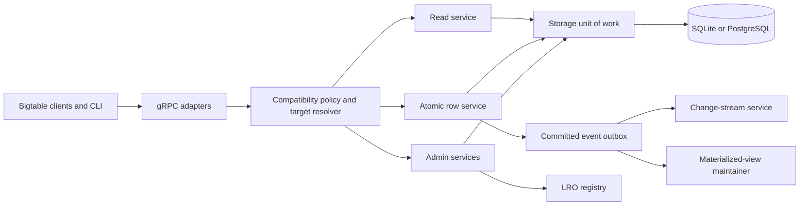

# Bigtable Emulator Conformance Architecture

**Status:** Approved

**Date:** 2026-08-29
**Inputs:** `BIGTABLE_COMPATIBILITY.md`, current `bttest` implementation, and the selected goals of developer parity plus broad protocol compatibility

## Purpose

Evolve the emulator into a trustworthy local Bigtable substitute for application development and bootstrap tooling. Correct observable behavior comes before RPC count. Every supported request must either behave according to the documented local contract or fail explicitly; unsupported semantics must not silently succeed.

The target is broader than Google's official emulator where local metadata is useful, but narrower than the managed service. The emulator will model deterministic single-process behavior, not distributed infrastructure.

## Goals

1. Match the useful Data and Table Admin contracts required by normal local development.
2. Register current public RPC surfaces and give every RPC an explicit tested disposition; implement where a meaningful local contract exists.
3. Preserve SQLite and PostgreSQL persistence without conflating persistence with replication or durability guarantees.
4. Make partial and deferred behavior explicit at RPC and request-field boundaries.
5. Allow difficult subsystems—change streams, backups, views, and SQL—to evolve independently.
6. Maintain one implementation path for SQLite and PostgreSQL semantics.

## Non-goals

The emulator will not simulate replication, failover, autoscaling, tablet balancing, node capacity, Data Boost compute, CMEK, Cloud Monitoring, Key Visualizer, or production latency. Metadata for some managed resources may be represented for tooling compatibility, but it must not imply functional emulation.

No implementation phase may introduce a second public API path, compatibility alias, or silent fallback. Callers move directly to the new behavior.

## Architectural decision

Adopt a **layered conformance core** while retaining the existing gRPC server and SQL stores. Extract behavior incrementally from the current handlers as each feature is repaired. Do not begin with an all-at-once rewrite.

Two alternatives were rejected:

- **Patch handlers in place:** fastest initially, but preserves the coupling that caused mutation rollback leaks, incomplete persistence, and silent request-field ignores.
- **Rewrite the server first:** clean in theory, but delays developer parity behind a large integration boundary and makes regression isolation difficult.

The layered approach wins because it supports correctness-first delivery and protocol breadth in independent increments.

## System structure

### 1. Thin gRPC adapters

The generated service implementations remain the transport boundary. An adapter performs only:

- protobuf request-shape validation;
- resource target resolution;
- delegation to a domain service;
- domain-error to gRPC-status translation;
- streaming response delivery.

Adapters must not mutate rows, implement filters, issue SQL directly, or synthesize successful managed behavior. Existing methods in `bttest/inmem.go`, `instance_server.go`, and LocalCloud feature files move toward this boundary as they are touched.

### 2. Compatibility policy and target resolver

Add one explicit policy for supported RPCs and meaningful request fields. The policy distinguishes:

- implemented with local semantic parity;
- deliberately simplified with a documented deterministic local contract;
- unsupported and rejected;
- managed-only and not applicable.

The target resolver converts table, authorized-view, materialized-view, and future session targets into a single `ReadTarget` or `WriteTarget`. It also resolves app-profile behavior. Until a target or routing mode is implemented, resolution returns an explicit error before any storage access.

Use consistent status mapping:

| Condition | gRPC status |
| --- | --- |
| Malformed request, mask, range, or filter | `InvalidArgument` |
| Missing resource | `NotFound` |
| Duplicate resource | `AlreadyExists` |
| Recognized but unsupported state transition | `FailedPrecondition` |
| Unsupported RPC or semantic target | `Unimplemented` |
| Deletion protection or active dependency | `FailedPrecondition` |
| Transaction conflict, if introduced | `Aborted` |
| Storage failure | `Internal` without process termination |

### 3. Atomic row service

All single-row mutation paths use one engine:

1. Load the current row within a storage unit of work.
2. Clone it into a private mutable candidate.
3. Validate every mutation or read-modify-write rule before committing.
4. Apply operations to the candidate in request order.
5. Apply deterministic local GC where required by the contract.
6. Persist the final row once.
7. If an enabled feature requires eventing, append one committed event record in the same SQL transaction.
8. Commit, then construct the RPC response from committed state.

`MutateRow`, each `MutateRows` entry, `CheckAndMutateRow`, and `ReadModifyWriteRow` share this engine. A failed operation leaves row data, the change-stream outbox, and materialized views unchanged. `SqlRows` must stop treating storage errors as process-fatal and gain transaction-aware operations.

### 4. Read pipeline

Reads use explicit stages:

1. Resolve and authorize the target.
2. Normalize exact keys and row ranges into a deduplicated range plan.
3. Read rows in requested direction with row-limit semantics.
4. Execute the filter tree without mutating stored state.
5. Encode chunks under a configurable local response-size limit.
6. Emit progress, last-scanned-row, and requested statistics where supported.

The filter executor becomes a standalone pure component. It must preserve documented `Interleave` duplicates, reject or correctly implement `Sink`, implement `ValueBitmask`, and validate filter depth and arguments before row iteration.

The emulator does not model production performance. Unbounded full-table scans remain functionally possible but are not evidence of safe production performance.

### 5. Durable resource catalog

Replace partial struct serialization with explicit persisted records for:

- instances, clusters, and app profiles;
- tables, column families, table policies, and change-stream configuration;
- authorized, logical, and materialized views;
- schema bundles;
- backups and immutable backup manifests;
- long-running operations;
- IAM policy metadata where round-trip compatibility is promised.

Each repository owns serialization and update-mask application for one resource type. List operations must implement deterministic ordering, parent scoping, page size, and page tokens. Delete operations enforce dependencies and deletion protection consistently.

Schema changes use additive migrations followed by a clean cutover. Old serialized family blobs may be read only during the migration that rewrites them into the new schema; no permanent dual-write compatibility path remains.

### 6. Long-running operation registry

Admin methods that return an LRO must insert it before returning. The registry supports `GetOperation`, `ListOperations`, and `WaitOperation`. Locally completed work may still produce an immediately done operation, but its name, metadata, response, error, and timestamps remain queryable.

Cancellation is implemented only for work that can actually be interrupted. Otherwise it returns an explicit terminal status rather than pretending cancellation succeeded.

### 7. Optional feature modules

Complex features depend on stable core interfaces rather than calling handlers directly:

- **Change streams** consume the committed event outbox and own retention, partitions, continuation tokens, heartbeats, and close records.
- **Backups** snapshot immutable table schema and row data through the storage layer and restore without consulting a live source table.
- **Authorized views** supply read/write target policies to the shared data pipeline.
- **Materialized views** consume committed events and maintain derived data asynchronously or synchronously according to an explicit local consistency contract.
- **Logical views and SQL** share a query engine if SQL becomes an approved product goal; metadata CRUD alone never claims executable view support.
- **Aggregate families** own typed encoding and aggregation rules; ordinary families reject aggregate mutations.

## Complexity classification

### Easy or contained gaps

These changes are localized, require no new execution engine, and can be completed independently after the conformance harness exists.

| Gap | Implementation boundary | Main risk |
| --- | --- | --- |
| Checked-in Go module metadata | Correct `go` directive and dependency checksum alignment | Build reproducibility only |
| Unsupported field/target handling | Add compatibility policy and early explicit rejection | Accidental breaking change for callers relying on silent ignores |
| App-profile and read-stat modes | Validate known values and reject modes without local semantics before storage access | Existing callers may rely on ignored fields |
| `SampleRowKeys.row_range` | Restrict candidate sampling to the requested range | Boundary correctness |
| `Interleave` duplicates | Remove deduplication and replace incompatible test | Cell ordering and limit interactions |
| `Sink` | Return `Unimplemented` first; implement only with output-cursor tests | Silent semantic mismatch |
| `ValueBitmask` | Add pure per-cell filter and length validation | Binary-value edge cases |
| GC intersection | Keep cells retained by any child; add nested truth-table tests | Nested union/intersection logic |
| Table policy persistence | Persist deletion protection and automated-backup configuration | Migration of existing rows |
| Current table metadata | Persist row-key schema and supported update-mask fields; explicitly reject initial splits until a partition model exists | Round-trip fidelity without implying partition behavior |
| Parent scoping and deterministic list order | Normalize list helpers across resources | Page-token stability |
| Schema-bundle metadata CRUD | Add persisted descriptors and admin handlers | Size validation and immutable fields |
| Immediately completed LRO storage | Insert returned operations and support get/list/wait | Consistent response serialization |
| Local consistency tokens | Persist or deterministically resolve tokens against the single committed store | Avoid implying replica consistency checks |
| IAM metadata contract | Persist policy round trips while documenting the no-auth local serving model | Tooling compatibility must not imply authorization enforcement |
| Local `Locations` response | Return one documented synthetic local location if tooling requires it | Avoid implying Cloud location parity |
| Local route lookup | Return the single emulator endpoint only if a client requires the public service | Client protocol compatibility |
| `cbt` smoke coverage | Exercise documented endpoint configuration and core commands | Tool-version drift |

“Easy” means architecturally contained, not automatically low priority. Several of these fixes prevent false-success behavior and therefore precede broader feature work.

### Complex or systemic gaps

These require a shared subsystem, transactional changes, a streaming protocol, or a substantial execution model.

| Gap | Required subsystem | Why complex |
| --- | --- | --- |
| Row mutation rollback safety | Atomic row service and SQL unit of work | Crosses four RPCs, persistence, eventing, and concurrency |
| Correct aggregate cells | Typed family schema and aggregate engine | Encoding, reset semantics, min/max/sum/HLL behavior |
| `ReadRows` chunking, progress, and stats | Read pipeline and chunk encoder | Stateful streaming, resume boundaries, client compatibility |
| Authorized-view enforcement | Shared target policy | Must constrain reads, writes, samples, IAM, and deletion behavior |
| Change streams | Transactional outbox and partition service | Retention, ordering, atomic grouping, continuation, split/merge |
| Real backups/copy/restore | Immutable snapshot store and LRO workflow | Data volume, consistency, expiry, copy, restore isolation |
| Materialized views | Derived-data engine | Query semantics, updates/deletes, consistency, replay, failures |
| Logical and parameterized views | SQL engine | Parsing, typing, parameters, execution, read-only semantics |
| GoogleSQL `PrepareQuery`/`ExecuteQuery` | Query engine and streaming result protocol | Broad language and type surface with resume tokens |
| New session RPCs | Session state and bidirectional streaming | Client-version coupling and protocol lifecycle |
| Cross-language and connector parity | Versioned conformance matrix | Different retry, streaming, and endpoint assumptions |
| PostgreSQL/SQLite concurrent equivalence | Storage transaction contract | Locking, isolation, dialect differences, error normalization |

### Explicitly deferred managed-service gaps

Managed behavior for replication and failover, autoscaling and node capacity, tablet balancing, Cloud location inventory, memory tiers, Data Boost compute, IAM authorization, CMEK, Key Visualizer, Cloud Monitoring, production hot-tablet analytics, and Dataflow/BigQuery/Pub/Sub connectors remains out of scope. A synthetic local location or permissive IAM metadata contract may be exposed for bootstrap tooling, but it must not imply managed location, security, or observability behavior. Managed RPCs and fields are otherwise rejected or exposed as metadata-only according to the compatibility policy.

## Delivery principles

1. Correctness fixes land before breadth features that depend on them.
2. Each phase has a runnable client-level acceptance scenario.
3. Source-inferred parity is insufficient for a “supported” label; observable behavior needs a conformance test.
4. Unsupported fields fail before state mutation.
5. Storage and event records commit together.
6. No test protects behavior known to contradict the official contract.
7. Full-table scan success is functional only; production performance diagnosis belongs in Key Visualizer first, followed by hot-tablet/table statistics and full request stats.

## Testing architecture

Use three layers:

- **Pure contract tests:** filters, ranges, GC truth tables, encodings, update masks, page tokens, and target resolution.
- **Service tests:** direct RPC handlers against both SQLite and PostgreSQL repositories where available.
- **Client conformance tests:** official Go client plus `cbt`; add one non-Go client before claiming language-independent compatibility.

Every bug fix includes a regression that fails against the old behavior. Permanent tests assert observable Bigtable contracts, not source layout. Managed-only behavior is covered by explicit error assertions.

## Success criteria

The architecture is successful when:

- failed single-row requests leave no partial row or event changes;
- every public RPC and meaningful request field has an explicit tested disposition;
- supported table-targeted Go and `cbt` workflows require only documented emulator configuration;
- persisted resources survive restart with all supported fields intact;
- views, backups, and change streams cannot report success without their promised data behavior;
- SQLite and PostgreSQL pass the same conformance contracts;
- the compatibility audit can be generated from tests and capability declarations without contradicting runtime behavior.
