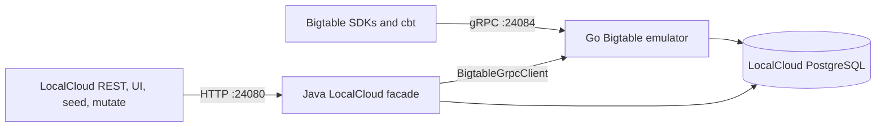
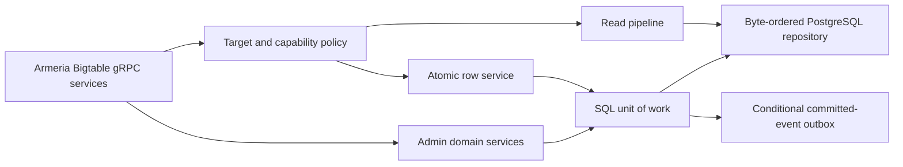

# Native Java Bigtable Emulator Evaluation

**Status:** Evaluation and recommendation  
**Date:** 2026-08-29  
**Related:** [`BIGTABLE_COMPATIBILITY.md`](../../../BIGTABLE_COMPATIBILITY.md), [`2026-08-29-bigtable-conformance-architecture-design.md`](2026-08-29-bigtable-conformance-architecture-design.md), [`2026-08-29-bigtable-conformance-implementation-plan.md`](../plans/2026-08-29-bigtable-conformance-implementation-plan.md), and [`primary-source notes`](../research/2026-08-29-java-bigtable-emulator-primary-sources.md)

## Executive verdict

A native Java Bigtable emulator inside LocalCloud is **technically feasible**. The required Bigtable Data and Admin generated Java server bases already exist in LocalCloud's dependencies, and LocalCloud already hosts native gRPC services through Armeria.

It is **not currently the best engineering investment**. LocalCloud already packages the Go emulator in the same Docker image, supervises it as an internal process, connects it to the shared PostgreSQL service, exposes `BIGTABLE_EMULATOR_HOST`, and supplies a Java REST/UI facade over gRPC. A rewrite would remove one internal process and one language from the build, but it would recreate roughly 5,000 lines of behavior-heavy production code and 5,600 lines of tests while adding migration and semantic-parity risk.

**Recommendation:** retain the Go emulator as the Bigtable engine and harden the Java facade/integration. Reconsider a native Java replacement only if a Java-only/single-process runtime becomes a firm product requirement. If that requirement appears, build a clean Java implementation behind the existing conformance contract; do not split Table Admin and Data semantics across Java and Go.

## What exists today

### Runtime topology

The current LocalCloud integration is already a hybrid with a strong packaging boundary:

- `localcloud.defaults.yaml` declares Bigtable as an external gRPC service on port `24084` and exports `BIGTABLE_EMULATOR_HOST`.
- LocalCloud's Dockerfile builds `github.com/jhsenjaliya/little_bigtable` and copies the static binary into the final LocalCloud image.
- `docker/conf/supervisord.conf` runs it as `bigtable-emulator`.
- `docker/bigtable-connect.sh` supplies the shared PostgreSQL connection.
- `BigtableAdminService` provides REST/UI operations and delegates to the Go server through `BigtableGrpcClient`.
- `BigtableRegistrar` wires the Java facade into seeding, mutation, IAM, and gateway routing.

This means the primary operational objection to a sidecar—requiring users to install or orchestrate another image—does not apply. Users already receive one LocalCloud image. The cost is an additional internal process, port, health boundary, and loopback gRPC hop.

### Existing implementation surface

Measured from the current workspaces:

| Surface | Lines |
| --- | ---: |
| Go Bigtable production code under `bttest` | 5,053 |
| Go Bigtable tests under `bttest` | 5,591 |
| LocalCloud Java Bigtable facade/registrar | 493 |
| LocalCloud `BigtableGrpcClient` adapter | 476 |

Line counts do not measure semantic difficulty, but they show that this is a rewrite rather than a controller addition. The most difficult behavior is concentrated in row mutation, filters/GC, streaming reads, persistence, change streams, backups, and views.

### Local history matters

LocalCloud previously had a native Java `BigtableStore` backed by `bigtable_instances` and `bigtable_tables`:

- commit `843092b` introduced metadata-only Java storage;
- commit `7571b1e` removed that store from `BigtableEmulator` and replaced it with gRPC delegation to the external emulator.

The old store modeled instance/table metadata only. Its `bigtable_data` schema used a string row key and one JSONB cell object, which cannot represent arbitrary binary row keys, multiple timestamped cell versions, filter semantics, or atomic mutation groups correctly. The history does not document the decision rationale, but the cutover coincides with using the Go server for the real Data and Admin protocols. **[INFERENCE]** This is evidence that the native metadata facade was insufficient once LocalCloud needed SDK-compatible data behavior.

## Why native Java is doable

### The protocol machinery already exists

LocalCloud already pins:

- `grpc-google-cloud-bigtable-v2`;
- `proto-google-cloud-bigtable-v2`;
- `grpc-google-cloud-bigtable-admin-v2`;
- `proto-google-cloud-bigtable-admin-v2`.

The pinned version is `2.81.0`; Maven Central currently publishes `2.82.0` for both [Data](https://repo1.maven.org/maven2/com/google/api/grpc/grpc-google-cloud-bigtable-v2/maven-metadata.xml) and [Admin](https://repo1.maven.org/maven2/com/google/api/grpc/grpc-google-cloud-bigtable-admin-v2/maven-metadata.xml). The dependencies provide `BigtableGrpc.BigtableImplBase`, `BigtableTableAdminGrpc.BigtableTableAdminImplBase`, and `BigtableInstanceAdminGrpc.BigtableInstanceAdminImplBase`.

LocalCloud already registers many generated `ImplBase` services with Armeria's `GrpcServiceBuilder`. Armeria officially supports adding generated `BindableService` implementations, sharing a server with other services, and offloading blocking handlers with `useBlockingTaskExecutor(true)` ([Armeria gRPC guide](https://github.com/line/armeria/blob/main/site-new/src/content/docs/server/grpc.mdx), [threading model](https://github.com/line/armeria/blob/main/site-new/src/content/docs/advanced/threading-model.mdx)).

The official Java Bigtable client has emulator builders for Data and Table Admin clients. Google's `google-cloud-bigtable-emulator` Java artifact is itself a wrapper that launches the native emulator rather than an independent Java server implementation ([official Java wrapper README](https://github.com/googleapis/google-cloud-java/blob/main/java-bigtable/google-cloud-bigtable-emulator/README.md)). This confirms both client compatibility and the industry's normal wrapper/sidecar pattern.

### Java can implement the required semantics

Nothing in the Bigtable API requires Go. Java has suitable tools for:

- immutable protobuf messages and binary values through `ByteString`;
- ordered row-key indexing through a dedicated repository;
- JDBC transactions and PostgreSQL row locking;
- striped/per-row synchronization in one process;
- generated unary and server-streaming RPC bases;
- cancellation and readiness-aware flow control through `ServerCallStreamObserver` ([gRPC Java flow-control example](https://github.com/grpc/grpc-java/tree/master/examples/src/main/java/io/grpc/examples/manualflowcontrol));
- scheduled GC, backup, retention, and change-stream workers.

The challenge is not language capability. It is preserving the observable contracts in the [Bigtable Data API](https://docs.cloud.google.com/bigtable/docs/reference/data/rpc/google.bigtable.v2) and [Admin API](https://docs.cloud.google.com/bigtable/docs/reference/admin/rpc/google.bigtable.admin.v2).

## What cannot be reused directly

### The legacy LocalCloud Bigtable schema

The old Java schema is not a viable Bigtable storage model:

- `row_key VARCHAR(1024)` cannot preserve arbitrary bytes and bytewise ordering;
- one `cells JSONB` value does not naturally model family/qualifier/version ordering;
- it provides no row-level transactional event outbox;
- it does not support efficient bounded binary range scans.

### The current Go persisted blobs

The Go implementation stores table metadata and row families as Go `encoding/gob` blobs in `tables_t.metadata` and `rows_t.families`. Java cannot safely decode those as a long-term contract. A native cutover therefore needs either:

1. a one-time Go exporter that rewrites state into a language-neutral schema; or
2. an explicit decision that emulator state is disposable at the cutover.

Because persistence is a defining feature of this fork, silently discarding state is not an acceptable default.

### Generic facade storage patterns

A generic string-key/JSON store is appropriate for many control-plane emulators but not Bigtable. A native implementation needs a specialized byte-ordered transactional repository. Reusing a convenient generic store would make exact range scans, atomic rows, multi-version cells, and streaming behavior harder and less correct.

## Feasibility by subsystem

| Subsystem | Feasibility | Complexity | Notes |
| --- | --- | --- | --- |
| Bind Data/Admin gRPC services in Armeria | High | Easy | Generated server bases and registrar pattern already exist. |
| Instance/cluster/app-profile metadata | High | Easy | Can reuse LocalCloud validation, IAM, LRO, and PostgreSQL patterns. |
| Table/family metadata CRUD | High | Easy–Complex | CRUD is straightforward; complete update masks, aggregate types, policies, and migrations are not. |
| Basic set/delete/read | High | Complex | Requires a proper binary row model and streaming encoder. |
| Single-row atomicity | High | Complex | Must stage, validate, commit data and enabled-feature events once. |
| Filters and GC | High | Complex | Pure Java is suitable, but the truth tables are broad and subtle. |
| `ReadRows` chunking/resume/stats | High | Complex | Requires readiness-aware streaming, cancellation, bounded buffering, and JDBC offload. |
| Authorized views | High | Complex | Must constrain every read/write/sample path. |
| Backups | High | Complex | Requires immutable schema/data snapshots and LRO lifecycle. |
| Change streams | High | Very complex | Requires transactional events, retention, tokens, heartbeats, and partitions. |
| Aggregate families | High | Complex | Requires typed encodings and mutation enforcement. |
| SQL/logical/materialized views | Technically possible | Very complex | A query engine dominates the work; Java does not remove this complexity. |
| Managed replication/autoscaling/observability | Poor local value | Deferred | Remains outside a deterministic single-process emulator. |

“High feasibility” means the JVM can implement it, not that the work is small.

## Strategy comparison

### Option A — Keep Go engine, harden Java integration

**Description:** Continue compiling the Go binary into the LocalCloud image. Keep SDK Data/Admin traffic on the dedicated Bigtable port and use the Java facade for REST/UI/lifecycle integration.

**Pros**

- Preserves the existing functional surface and test investment.
- No persisted-data migration.
- Maintains standalone SQLite/PostgreSQL use outside LocalCloud.
- Separate process provides failure and memory isolation; supervisor can restart it independently.
- Go is well suited to gRPC streaming and a small static data-plane binary.
- Lets the approved correctness roadmap improve one implementation rather than two.

**Cons**

- Two languages and build toolchains.
- One additional internal process and port.
- REST facade calls pay a loopback gRPC/channel cost.
- Health, reset, logs, configuration, and capability reporting cross a process boundary.
- Cross-service in-process hooks need an RPC/event contract.

**Assessment:** Best current value and lowest correctness risk.

### Option B — Clean native Java replacement

**Description:** Implement Data, Table Admin, Instance Admin, Operations, and persistence in LocalCloud Java; bind them to the Armeria gRPC server and make the gateway port the Bigtable endpoint.

**Pros**

- One process, port, language, lifecycle, and observability stack.
- Direct reuse of LocalCloud IAM, LRO, seed/reset, configuration, and request metrics.
- REST/UI calls can invoke the domain service directly rather than create gRPC channels.
- Removes Go build/release integration and supervisor wiring.
- Enables a language-neutral storage schema instead of Go gob.
- Easier in-process integration with other LocalCloud services.

**Cons**

- Reimplements every subtle Bigtable contract and all current tests.
- Starts behind the current Go feature surface while the Go implementation is itself being corrected.
- Requires a persisted-state migration.
- Couples Bigtable memory leaks, blocking I/O, and crashes to the LocalCloud Java process.
- Large scans require careful event-loop offload and explicit gRPC flow control.
- Risks weakening standalone emulator support unless Java becomes a separately packaged product.
- Creates a period where two implementations can drift unless differential testing is mandatory.

**Assessment:** Doable but negative near-term return unless Java-only operation is strategic.

### Option C — Java Admin/control plane with Go Data plane

**Description:** Move instance/table/view/backup metadata into Java while retaining row reads/writes in Go.

**Pros**

- Superficially reuses LocalCloud's admin infrastructure.
- Reduces some Java-to-Go control calls.

**Cons**

- Creates two authoritative stores for tables, families, policies, backups, views, and operations.
- Every table mutation needs synchronization before Data RPCs can observe it.
- Atomic backups, change streams, authorized views, and deletion become cross-process transactions.
- Failure recovery introduces split-brain behavior.

**Assessment:** Reject. Bigtable Admin and Data share too many invariants.

### Option D — Embed Go through JNI/c-shared

**Description:** Compile the Go engine as a native library and call it in-process from Java.

**Pros**

- One OS process and no loopback gRPC.

**Cons**

- Replaces a well-defined gRPC boundary with JNI/cgo ownership, memory, threading, callback, and crash hazards.
- Complicates multi-platform and container builds.
- A native crash still terminates Java.
- Does not remove the Go toolchain or Go implementation.

**Assessment:** Reject. It combines the disadvantages of both languages without creating a stable product boundary.

## Native Java target architecture, if approved later

A Java rewrite should not port handlers line by line. It should implement the approved conformance architecture directly:

### Service boundary

Implement separate generated service classes:

- `BigtableDataService`;
- `BigtableTableAdminService`;
- `BigtableInstanceAdminService`;
- a shared Operations service or adapter to LocalCloud's existing LRO registry.

`BigtableRegistrar` should register all services through LocalCloud's contract-aware `grpcService` helper. The REST facade should call domain services directly, not instantiate a new `ManagedChannel` per request.

### Storage boundary

Use one specialized repository rather than the old `bigtable_data` table:

- binary row key in an order-preserving column;
- one canonical, language-neutral row encoding, preferably an internal protobuf;
- one row load/validate/commit transaction;
- bounded ordered range scans with fetch-size control;
- table/resource protobuf metadata or explicit versioned records;
- a committed-event outbox written in the row transaction only when an enabled feature requires it.

A row blob is the simpler local-emulator model: it preserves row atomicity and keeps range indexing separate from cell serialization. A normalized row-per-cell schema makes analytical SQL easier but substantially increases transaction and scan complexity.

### Execution boundary

JDBC work must run on Armeria's blocking executor. Server streams must use `ServerCallStreamObserver.isReady()`, an on-ready handler, and cancellation handling so a slow client cannot cause the server to materialize an unbounded scan.

## Native rewrite migration strategy

If Java is chosen, use a clean cutover:

1. Freeze the externally observable capability ledger and conformance suite.
2. Add a canonical storage schema and Go export/migration command.
3. Implement Java against the canonical schema without dual-writing.
4. Run the same official Java SDK, Go SDK, `cbt`, and persistence tests against both implementations.
5. Differentially compare responses after normalizing timestamps and generated identifiers.
6. Stop writes, run the one-time migration, switch the endpoint, and remove Go/supervisor wiring.
7. Delete the legacy LocalCloud `bigtable_*` schema and Go gob readers after the migration boundary.

Do not retain a permanent runtime fallback. A fallback hides incompatibility and leaves two engines to maintain.

## Recommended work now

### 1. Finish the Go correctness baseline

Complete mutation atomicity, filter/GC corrections, explicit target rejection, and storage error propagation from the existing implementation plan. Porting known defects before defining the contract would only preserve them in Java.

### 2. Make conformance language-neutral

Drive both implementations, if a Java spike occurs, through:

- official Java and Go clients;
- `cbt`;
- protobuf request/expected-status fixtures;
- restart/persistence scenarios;
- binary key and large streaming row cases.

This suite is the reusable asset; the implementation language is secondary.

### 3. Harden the current Java facade

High-value integration work that does not require a rewrite:

- keep one lifecycle-managed gRPC channel/stub set instead of creating `BigtableGrpcClient` per REST request;
- restore readiness reporting rather than allowing the first user request to discover startup failure;
- expose Go engine version and capability status through LocalCloud service info;
- make reset/seed failures explicit rather than best-effort warnings;
- remove or quarantine the stale `bigtable_instances`, `bigtable_tables`, and `bigtable_data` schema paths still referenced by LocalCloud health/seeding checks;
- align logs and PostgreSQL diagnostics with the LocalCloud lifecycle coordinator.

### 4. Run a bounded native-Java decision spike only if needed

The spike should prove the hard parts, not CRUD:

- register native Data and Table Admin services on the Armeria gateway;
- create one table/family;
- atomically reject a mutation after an earlier valid mutation without changing the row;
- stream a large binary row through the official Java client with readiness/cancellation handling;
- execute ordered open/closed binary row ranges from PostgreSQL;
- run the same fixtures against Go and Java.

A successful CRUD-only spike is not evidence that a Java rewrite is viable.

## Decision criteria

Choose native Java only if all of these become true:

1. Java-only or single-process deployment is a firm product requirement, not a preference.
2. The team accepts responsibility for the full Data/Admin conformance surface.
3. A canonical storage migration is approved.
4. The vertical slice proves binary range scans, row atomicity, streaming backpressure, and client compatibility.
5. The same conformance suite can run against both engines during the cutover.
6. Standalone little_bigtable users either receive a Java distribution or have an explicit supported transition.

Keep the current Go engine if correctness, time-to-compatibility, standalone reuse, failure isolation, and migration safety matter more than eliminating one internal process.

## Final recommendation

**Do not rewrite the emulator in Java now.** The current Java-facade/Go-engine boundary is already integrated into one LocalCloud image and is architecturally appropriate for a data-plane emulator. Improve that boundary and finish the correctness roadmap first.

A native Java implementation remains a credible future option. Its strongest case is organizational and operational—one language, one process, one port—not technical necessity. Those benefits do not currently outweigh the rewrite, migration, and semantic-drift costs.
